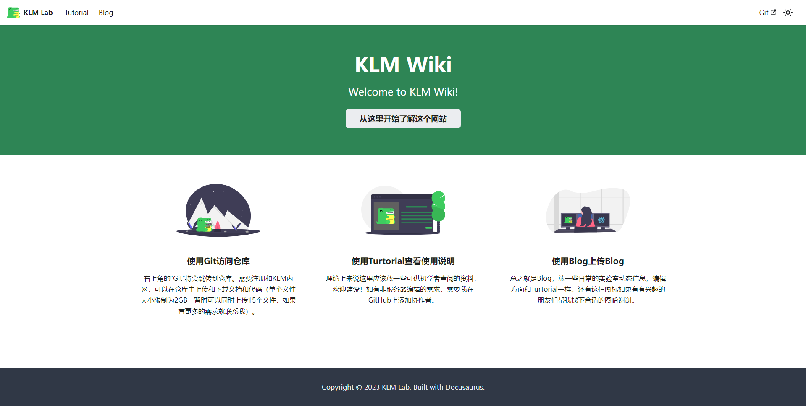
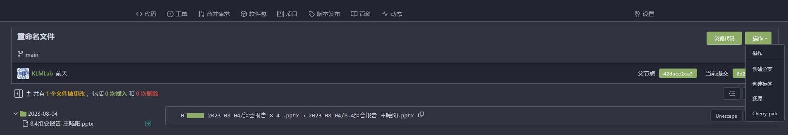

# 使用简介

大家好，我是负责搭建这个网页的人。虽然说我觉得都能看到这个教程的人看这个教程没什么必要，但是这里还是对这个网站做一个简要的介绍。顺带一提，如果只是普（bei）通（po）地使用，那么看完“Hello页面”章节和“Git仓库基础”页面就足矣。想要更深入地使用或者维护的话可以参考一下其他章节、询问我（baizb@mail.nankai.edu.cn）、或者自己去查资料。

wiki这种东西，大家都想用，大家都懒得维护，不过大家要都想好好用就都只能好好维护，所以我还是希望大家支持我的工作的，感谢各位。

## Hello页面

如你所见，这个欢迎页面的全部功能在欢迎页面的首页上已经写好了。

### Tutorial

这里存放着指南文件，包括这篇应该也是在这里的。这里想要建设成为同学们可以查阅基础资料和公共资源的地方。所以日常的一些其他内容，应该放到`blog`中去。

使用的语法是`markdown`，一般来说不涉及到编辑的问题。如果其他没有在用服务器这台电脑的人要编辑的话，需要在github上添加信任（总之我写这篇稿件的时候用的还是我的个人网站，添加信任的事情应该也是下一任维护者的工作，下一任维护者去看后面的章节或者自己去学github）。

### Blog

这里存放着Blog。除了定期的组会指路外，一些大大小小的通知和日程应该也会放在这里。

同样使用`markdown`语法，同样需要添加信任后才能编辑。

既然是Blog，就涉及到很多其他同学也需要添加新文件到里面。那么我在这里简要写一下添加blog的github情况，以图形化页面为准。使用代码的情况请参考后续的章节。

虽然不是要编辑这篇Blog，不过我们还是可以通过这个“编辑此页”来到达我们想要到的GitHub页面（当然你也可以直接收藏GitHub页面哈）。

大家可以看到这个目录里面有`blog`也有`docs`（docs就是Tutorial）。那么我们想要添加一个新的Blog，只需要选中`blog`目录后，在右上角`Add file`上传自己写好的`md`文件即可。

顺便叮嘱一句，默认的branch是`main`，我们改的也是`main`，不要去`gh-pages`那边修改哈，没啥用。

至于写`markdown`文件，在指南的`Tutorial - Basics`-`Markdown Features`有详细的介绍（当然自己去搜也行）。当然，最简单的方法还是下载一个别的blog自己看着改哈（）

然后有一些规则希望大家可以遵守一下：

- 文件名中后面的名字随便取做区分就行，前面的日期就是博客的日期（并不是以添加的真实日期为准，是以这个文件名的时间为准）

- `slug`是博客内的标题，`title`是侧边栏标题，总之尽量写得好认一点（何时何人何事这个顺序来写）

- `author`想写可以写一下，其中`url`是点击头像后跳转到的网页，可以放一下个人主页啥的。

- `tags`是标签。因为暂时还没做搜索功能，所以寻找相应博客最有力的工具就是标签。请各位同学在上传博客的同时将自己的名字、博客类型、文中项目等内容加入标签中，方便他人检索。

### Git

点击页面右上角的`Git`就可以跳转到我们正在使用的git仓库了，访问git仓库需要内网，详见下一章。

## Git仓库基础

虽然但是，还是在这里标注一下仓库地址：`192.168.31.167`

Git仓库其实也就是我们自己搭建的“GitHub”，它的基础用法和GitHub是没有区别的。

### 注册

乍一进来可能感觉自己走错了（主要是我也懒得配置初始页面了哈，大家对付用），不过先点击右上角的注册，注册为新用户。为了方便辨识，希望大家能够将用户名设为姓氏全拼加名字首字母的形式（假设我叫张三三，那么我就注册为zhangss）（重名了的话就再另说哈），然后邮箱使用自己的工作邮箱。

然后记得告诉管理员，他会把你加入`Lab`组织。这样可以参与写入一些Lab下的文件（如上传每周的报告到Reports中）。

### 个人首页

进来后应该就是这样的页面，我这里内容比较丰富是因为我这里是管理员端哈，大家看到的应该是比较朴素的版本，这里是你的个人首页。平时也可以点击左上角的茶杯来到达首页。

### 探索

点击探索后，首先可以看到其他人的公开库（因为我这里是管理员哈所以能看到别人的私人库，非管理员账户是看不到的），里面有很多公开的资源（软件资源或过往的组会报告）。

### 上传文件

Git仓库不比一般的网盘，上传进去的东西要重命名需要git操作（或者你手动删掉然后重新上传改好名字的）。为了减轻麻烦，就改好名字再上传哈。

添加文件也很简单，和普通的网页差不多。

上面那个是它的路径，如果要在路径下新建文件夹就继续斜杠就行。

目前的限制是一次上50个文件，每个最大2G，这个可以改，具体怎么改在管理员那一章。

提交变更那一栏像标题的实际上就是显示在仓库中段的更新信息，可以在这个地方简要描述自己的报告主题。下面的详细信息也可以自己介绍下更改或者总结之类的，方便打开文件的同学了解大致信息。

### 误删除文件找回

如果误删除，需要使用git命令回退节点。

删除过文件后，会在`提交`这一栏中看到自己Delete的节点，点击上一个节点（的那一串乱码）。

在右上角选择`操作`-`还原`即可。

### 创建自己的库

如果自己想要把自己的代码拿来和其他同学协作、或者只是单纯想要找一个实验室的云盘，那么可以自己创建库。在网页的右上角就可以看到一个加号，这里自然可以创建新的仓库，或从GitHub等网站将库迁移过来。

顺带一提，如果想要和A同学，B同学三个人一起写这些代码，但是不希望其他人来捣乱，可以在三个人之间建立一个组织，或在Lab组织下建立一个三个人的团队。这样在建立库的时候，所有者可以选择该组织或团队，这样之后有一个C同学想要加入你们，只需要让他加入你们的团队，而不用再麻烦地进行各类授权等。

如果只是单纯地存放文件，应该没什么要特别注意的地方。看不懂的选项都空着就可以。如果涉及到代码协作，具体请参考一些细致的git教程。

## 管理者基础

### Hello页面

如你所见，这个页面用的图像资源都是初始的，如果你有心，可以去docusaurus的官网学习一下，然后替换一些。这里附上了docusaurus的中文官网https://docusaurus.nodejs.cn/docs

目前做了GitHub Action进行自动部署（参考`指南`-`部署`-`使用 GitHub Actions 触发部署`），所以只需要修改github目录中`main`分支的内容即可（自动部署会将`main`分支中的内容通过`npm`的方式打包到`gh-pages`分支，该分支是网站资源，都是打包好的html文件）。

如果有其他同学想要参与修改tutorial或者blog，在github的这个仓库中将这些同学的github账号添加为协作者即可。

### Git仓库

采用`gitea`框架搭建的仓库，详细操作可以去找有关gitea的教程。

根目录位于`H:\gitea`下，一般来说涉及到你管的情况只有两种，一种是需要库迁移（比如说H盘不够放了，或者想要放到树莓派里），一种是需要一口气上传更多文件或更大文件。

不论哪种都只涉及到目录下`\custom\conf\app.ini`的问题，点开它后，可以对库进行一些个性化修改。

比如迁移后，除了要把整个gitea文件夹搬迁到服务器上的新盘，还需要将`WORK_PATH`和`[serve]`下的`APP_DATA_PATH`的路径修改；比如要挪到其他机器上，修改`[serve]`下的`SSH_DOMAIN`、`DOMAIN`、`ROOT_URL`；比如要修改上传的最大数量、上传的最大大小等，均在`[repository.upload]`下，`FILE_MAX_SIZE`的单位是`MB`……

在网页端，一般就是要在组织中把新来的同学加入Lab下的members中。

## 深度学习

如果想要更好地使用仓库，可以学习一下git。我当时参考的是b站上李立超老师的课程：https://www.bilibili.com/video/BV1124y117Dr/?spm_id_from=333.337.search-card.all.click，大家也可以自行学习git。如果要使用代码来使用git的话，我推荐还是使用vscode。

vscode、git、可以快速访问github的工具在内网仓库中都有哈，自行下载。

本来其实应该在这里写一些基础的git语句但是我懒得写了！总之大家加油！维护靠大家了！