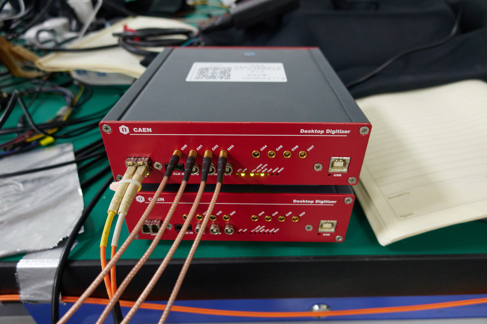

# work at fudan klm lab

## Introduction
Welcome to my work display webpage! Explore our projects and achievements below.

## Reports 
### group meetings
[slides](http://192.168.31.167/zhanghy/KLMlab/src/branch/main/GroupMeeting)
### Belle II
[slides](http://192.168.31.167/zhanghy/KLMlab/src/branch/main/reports_Belle2)
### CEPC
[slides](http://192.168.31.167/zhanghy/KLMlab/src/branch/main/reports_CEPC)

## Projects

### efficiency
- **Description:** Brief description of the project.
- **Technologies Used:** List of technologies used.
- **PDF Documentation:** [Documentation PDF](http://192.168.31.167/zhanghy/KLMlab/src/branch/main/GroupMeeting)

### time resolution
- **Description:** Brief description of the project.
- **Technologies Used:** List of technologies used.
[//]:- **Link to Project:** [Explore Project](#)
- **PDF Documentation:** [Documentation PDF](http://192.168.31.167/zhanghy/KLMlab/src/branch/main/GroupMeeting)

### equipments in lab

## Contact
Feel free to reach out for questions or collaboration opportunities.
- **Email:** 20210200004@fudan.edu.cn

## About Me
现代物理研究所2020级硕士
核科学与技术系2016级本科生
---

*Thank you for visiting!*

