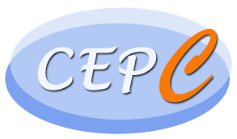

# Work at Fudan klm lab

## Introduction
Welcome to my work display webpage! Explore our projects and achievements below. 

## Reports 
### Group meetings
- [slides](http://192.168.31.167/zhanghy/KLMlab/src/branch/main/GroupMeeting)
### Belle II 

- [slides](http://192.168.31.167/zhanghy/KLMlab/src/branch/main/report_Belle2)  
- past conferences:  
  - <https://indico.belle2.org/event/9354/sessions/3183/#20230602>  
  - <https://indico.ihep.ac.cn/event/19066/page/1466>

### CEPC 

- [slides](http://192.168.31.167/zhanghy/KLMlab/src/branch/main/reports_CEPC)  
- past conferences:  
  - <https://indico.ihep.ac.cn/event/19495/>  
### Other reports
- [slides](http://192.168.31.167/zhanghy/KLMlab/src/branch/main/other)  

## Projects
### Equipment in lab
**Equipments list and price**  [excel](http://192.168.31.167/zhanghy/KLMlab/src/branch/main/information)
**introduction and manuals for equipments**  [kdoc](https://kdocs.cn/l/cgINrz7BmEwS)
- **CAEN**
  - [CAEN](caen.it)
- **scintillator**
  - 高能科迪[GNKD](http://www.gaonengkedi.com/)
  - 圣戈班
- **SiPM**
  - 滨松[MPPC](https://www.hamamatsu.com/us/en/product/optical-sensors/mppc.html)
  - [NDL](http://www.ndl-sipm.net/products.html)
### Code for work
- 示波器合并波形数据[merge](http://192.168.31.167/zhanghy/KLMlab/src/branch/main/code/other)
- 示波器读取数据[read](http://192.168.31.167/zhanghy/KLMlab/src/branch/main/code/other)
- CFD and Fit[T-CFD](http://192.168.31.167/zhanghy/KLMlab/src/branch/main/code/cfd)

## Contact
Feel free to reach out for questions or collaboration opportunities.
- **Email:** 20210200004@fudan.edu.cn

## About Me  
现代物理研究所2020级硕士
核科学与技术系2016级本科生

---

*Thanks to the guys who work together！* :smile:
*Thank you for visiting!*
